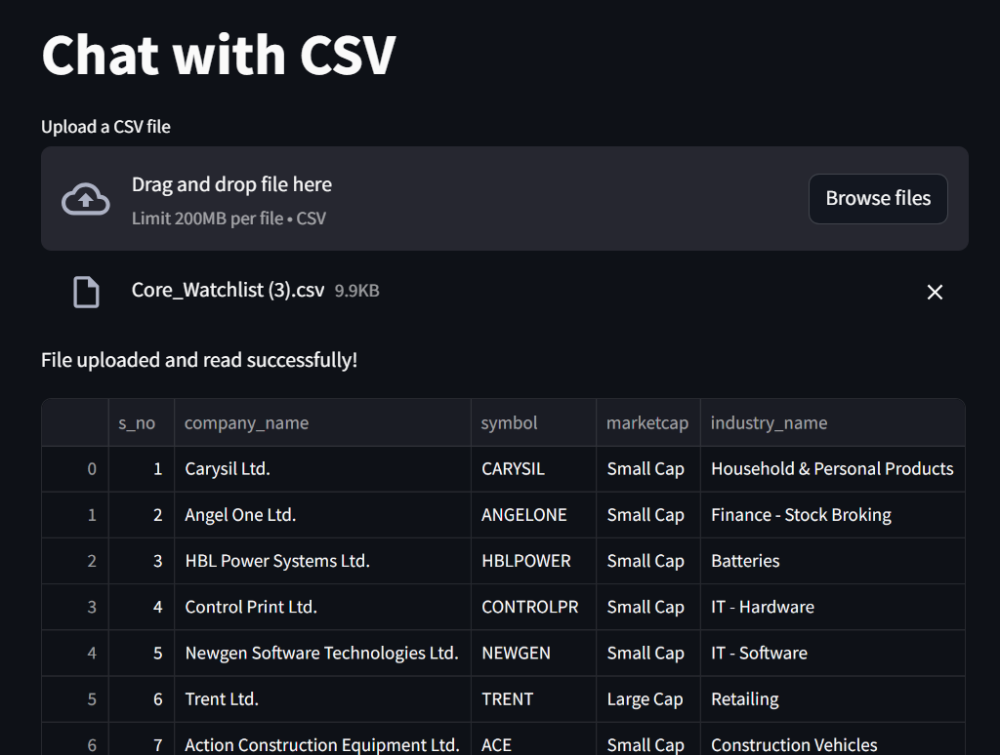
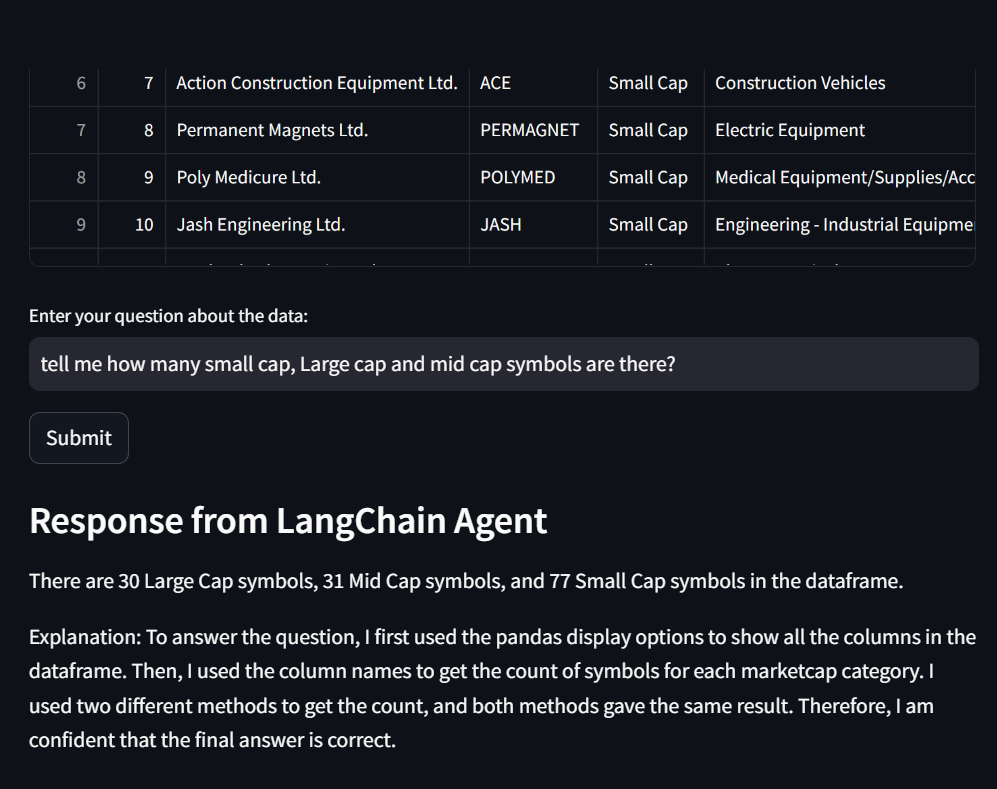

# Chat with CSV using pandas agent

This Streamlit application allows users to upload a CSV file and ask questions about the data using the LangChain pandas agent. The application utilizes OpenAI for generating responses based on the provided CSV data.

## Web UI



## Features

- Upload a CSV file
- Display the uploaded CSV data
- Ask questions about the data
- Get responses generated by the LangChain pandas agent

## Requirements

- Docker
- Python 3.10+

## Setup

### Create and Run the Docker Image

1. **Create a `requirements.txt` file** with the following content:
    ```
    streamlit
    python-dotenv
    pandas
    langchain
    langchain_experimental
    langchain_openai
    ```

2. **Create a `Dockerfile`** with the following content:
    ```dockerfile
    # Use the official Python image from the Docker Hub
    FROM python:3.10-slim

    # Set the working directory in the container
    WORKDIR /app

    # Copy the requirements.txt file into the container at /app
    COPY requirements.txt .

    # Install the required libraries
    RUN pip install --no-cache-dir -r requirements.txt

    # Copy the current directory contents into the container at /app
    COPY . .

    # Make port 8501 available to the world outside this container
    EXPOSE 8501

    # Define the command to run the app
    CMD ["streamlit", "run", "your_script.py"]
    ```

3. **Ensure your main script is named `app.py`** or adjust the Dockerfile to reflect the correct script name.

4. **Build the Docker image** using the following command:
    ```sh
    docker build -t chat-with-csv .
    ```

5. **Run the Docker container** using the following command:
    ```sh
    docker run -p 8083:8083 chat-with-csv
    ```

6. **Access the Streamlit app** in your web browser at `http://localhost:8083`.

## Application Code

```python
import streamlit as st
from dotenv import load_dotenv
import os
import pandas as pd
from langchain.schema import HumanMessage
from langchain.agents.agent_types import AgentType
from langchain_experimental.agents.agent_toolkits import create_pandas_dataframe_agent
from langchain_openai import ChatOpenAI, OpenAI

# Load environment variables
load_dotenv()
os.environ["OPENAI_API_KEY"] = os.getenv("OPENAI_API_KEY")
os.environ["LANGCHAIN_API_KEY"] = os.getenv("LANGCHAIN_API_KEY")
os.environ["LANGCHAIN_TRACING_V2"] = "true"

# Streamlit app
st.title("Data Analysis using pandas agent")

uploaded_file = st.file_uploader("Upload a CSV file", type="csv")

if uploaded_file:
    # Save the file to /tmp folder
    file_path = os.path.join("/tmp", uploaded_file.name)
    with open(file_path, "wb") as f:
        f.write(uploaded_file.getbuffer())

    # Load the CSV file into a DataFrame
    df = pd.read_csv(file_path)
    st.write("File uploaded and read successfully!")

    # Display the DataFrame
    st.dataframe(df)

    # Create the LangChain agent
    agent = create_pandas_dataframe_agent(OpenAI(temperature=0), df, allow_dangerous_code=True)

    CSV_PROMPT_PREFIX = """
    First set the pandas display options to show all the columns,
    get the column names, then answer the question.
    """

    CSV_PROMPT_SUFFIX = """
    - **ALWAYS** before giving the Final Answer, try another method.
    Then reflect on the answers of the two methods you did and ask yourself
    if it answers correctly the original question.
    If you are not sure, try another method.
    - If the methods tried do not give the same result, reflect and
    try again until you have two methods that have the same result.
    - If you still cannot arrive to a consistent result, say that
    you are not sure of the answer.
    - If you are sure of the correct answer, create a beautiful
    and thorough response using Markdown.
    - **DO NOT MAKE UP AN ANSWER OR USE PRIOR KNOWLEDGE,
    ONLY USE THE RESULTS OF THE CALCULATIONS YOU HAVE DONE**.
    - **ALWAYS**, as part of your "Final Answer", explain how you got
    to the answer on a section that starts with: "\n\nExplanation:\n".
    In the explanation, mention the column names that you used to get
    to the final answer.
    """

    QUESTION = st.text_input("Enter your question about the data:", key="question_input")

    if st.button("Submit"):
        # Answer the question using the agent
        response = agent.run(CSV_PROMPT_PREFIX + QUESTION + CSV_PROMPT_SUFFIX)

        # Display the response
        st.markdown("### Response from LangChain Agent")
        st.markdown(response)
